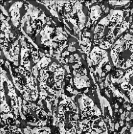
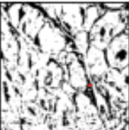

# Gastrointestinal-Cancer-MSI-MSS-Prediction-Using-Deep-Learning
> Gastrointestinal Cancer MSI MSS Prediction Using Deep Learning and Fastai

> Deep Learning has solved many complex tasks in the Medical Analysis. Developed a Deep Learning model to detect the Microsattelite status from histology images using Resnet50, CNN, VGG-16 Models and Support Vector Machine for Classifiying images.

## Table of contents
* [Screenshots](#screenshots)
* [Technologies](#technologies)
* [Dataset](#Dataset)

## Dataset
Link: https://zenodo.org/record/2530835#.X9tyeNgzZhE

## Screenshots

<table><tr></td><td></td><td></td></tr></table>
  

